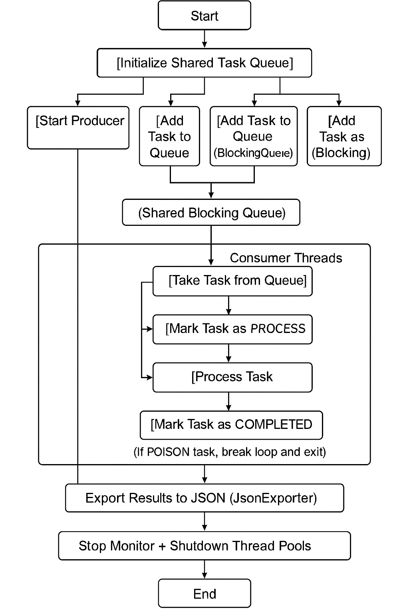

# Task Processor 🚀


A multithreaded Java application demonstrating core concurrency concepts including task production & consumption, thread monitoring, deadlock scenarios, and automated JSON export of task statuses.

# 📘 **Overview**

### ConcurQueueLab showcases:

🧵 Producer–Consumer pattern using PriorityBlockingQueue

🔁 Thread pool management & real-time monitoring

📊 Task lifecycle tracking with concurrent data structures

⚠️ Deadlock creation and prevention strategies

📤 Scheduled export of task status data to JSON

🧪 Custom metrics and thread pool analytics

## ✨ Features

✅ Concurrent Task Processing — Producers create tasks; Consumers process them in parallel

📌 Priority Task Queue — Tasks are ordered using PriorityBlockingQueue

📡 Thread Pool Monitoring — Real-time metrics via a dedicated logger thread

📈 Task State Tracking — Tracks lifecycle: SUBMITTED, PROCESSING, COMPLETED, FAILED

🗃️ Periodic JSON Export — Exports all task statuses every 1 minute

🔒 Deadlock Simulation & Resolution — Demonstrates how deadlocks occur and how to fix them

flowchart TD
```
graph TD

%% Initialization
Start(["Start"])
Init["Initialize Shared Task Queue"]
Start --> Init

%% Producers
P1["Start Producer 1"]
P2["Start Producer 2"]
Pn["..."]

Gen1["Generate Task 1"]
Gen2["Generate Task 2"]
GenN["..."]

Add1["Add Task to Queue (BlockingQueue)"]
Add2["Add Task to Queue (BlockingQueue)"]
AddN["Add Task to Queue (BlockingQueue)"]

Init --> P1 --> Gen1 --> Add1
Init --> P2 --> Gen2 --> Add2
Init --> Pn --> GenN --> AddN

%% Shared Queue
Queue["Shared Blocking Queue"]
Add1 --> Queue
Add2 --> Queue
AddN --> Queue

%% Consumers
CT1["Take Task from Queue"]
CT2["Take Task from Queue"]
CTN["..."]

Mark1["Mark Task as PROCESSING"]
Proc1["Process Task"]
Done1["Mark Task as COMPLETED"]

Mark2["Mark Task as PROCESSING"]
Proc2["Process Task"]
Done2["Mark Task as COMPLETED"]

Queue --> CT1 --> Mark1 --> Proc1 --> Done1
Queue --> CT2 --> Mark2 --> Proc2 --> Done2
Queue --> CTN

%% Poison Pill Handling
PoisonCheck1{{POISON Task?}}
PoisonCheck2{{POISON Task?}}

Done1 --> PoisonCheck1
Done2 --> PoisonCheck2

Exit1["Break loop & Exit"]
Exit2["Break loop & Exit"]

PoisonCheck1 -- Yes --> Exit1
PoisonCheck1 -- No --> CT1

PoisonCheck2 -- Yes --> Exit2
PoisonCheck2 -- No --> CT2

%% Output
Export["Export Results to JSON (JsonExporter)"]
Shutdown["Stop Monitor + Shutdown Thread Pools"]
End(["End"])

Exit1 --> Export
Exit2 --> Export
Export --> Shutdown --> End

```


## 🛠️ Prerequisites

Java JDK 24 or newer

Maven (for building and running)

IDE like IntelliJ IDEA (recommended)

## 📦 Dependencies
SLF4J API v2.0.7 - used for logging messages in a uniform way.

Logback Classic v1.4.7 — SLF4J implementation

Gson v2.10.1 - used for converting Java objects to JSON and vice versa.


## Project Structure 🗂️

```
src/
└── main/
    ├── java/
    │   └── com/
    │       └── example/
    │           └── taskprocessor/
    │               ├── Main.java
    │
    │               ├── core/
    │               │   └── Task.java
    │
    │               ├── consumer/
    │               │   └── Consumer.java
    │
    │               ├── producer/
    │               │   └── Producer.java
    │
    │               ├── utils/
    │               │   └── JsonExporter.java
    │
    │               ├── enums/
    │               │   ├── TaskStatus
    │
    │               └── monitor/
    │                   └── Monitor.java
    │
    └── resources/
        └── (application.properties)

```


#  **Activity Diagram**



### Installation

1. Clone the repository:
   ```bash
   git clone https://github.com/Boadu123/task_processor
   cd task_processor
   ```

2. Build the project:
   ```bash
   mvn clean package
   ```

3. Start-app Locally
    ```bash
   mvn exec:java -Dexec.mainClass="com.example.Main"
   ```
   
## ✅ Option 2: Using IntelliJ IDEA
1. **Open the project in IntelliJ**
2. **Ensure your Project SDK is set to Java 21+**
3. **Locate and run the main() method in ConcurQueueLab.java**

## ⚙️ Configuration

### Key configuration parameters in ConcurQueueLab.java:

numberOfTasks: Number of tasks per producer iteration

Producer threads: 3 threads

Consumer thread pool: 3 threads

Export interval: 1 minute

## Output

##### The application generates:

Console output: Real-time logging and final summary statistics

JSON files: Task status exports in the jsonExports/ directory

Thread monitoring logs: Performance metrics and thread pool status